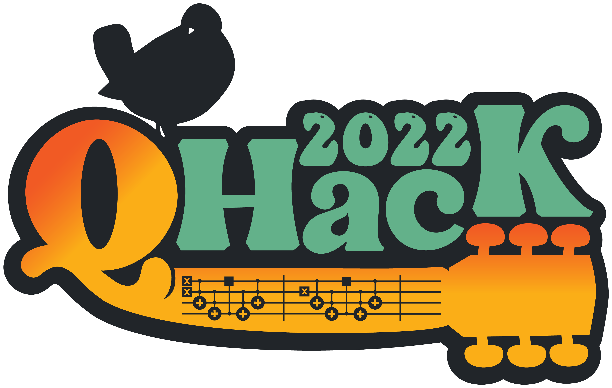
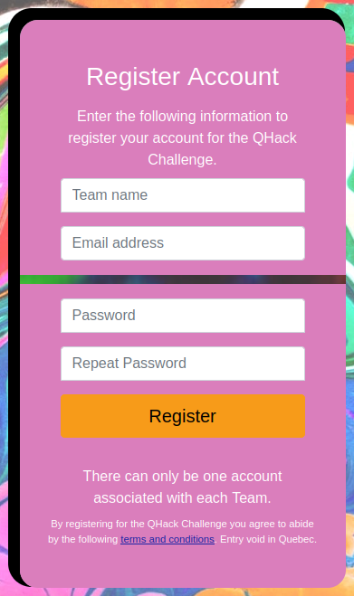

## QHack Coding Challenge

Think you're good at quantum computing, quantum machine learning, or quantum chemistry? Or just want an opportunity to learn more about these areas while sharpening your coding skills? Then join us for this year's QHack Coding Challenge!

The QHack Coding Challenge contains 25 individual problems across five categories:

- PennyLane 101
- Quantum Algorithms
- Quantum Machine Learning
- Quantum Chemistry
- Quantum Games

The questions range in difficulty, but can be tackled in any order. Answering questions correctly gives you points. Harder questions are worth more points. 
Take on the challenges as an individual or as part of a team (limit of one account per team). ***All team members must be [signed up](https://mailchi.mp/qhack/signups-2022) to QHack 2022***.

The QHack Coding Challenge will be available throughout the entire period of QHack (Feb 14-25), so you can tackle the questions at your own pace.

Feeling competitive? You can win additional prizes and power ups by ranking highly on the [QHack Coding Challenge Scoreboard](https://challenge.qhack.ai/public).

---

### Power Ups

You can tackle the QHack Coding Challenge at any time during QHack, but for those who want a bit more there are some time-sensitive *Power Ups* you can unlock. 

<?These credits can be used to build your [QHack Open Hackathon](Open_Hackathon.md) project. Teams can apply credits to any AWS service, including [Amazon Braket](https://aws.amazon.com/braket/), where they can showcase their ideas using Rigetti, IonQ, and D-Wave hardware or with high-performance simulators in the cloud.?>

---

### Timeline

| Sun | Mon | Tue | Wed | Thu | Fri | Sat |
|---|---|---|---|---|---|---|
|   | **Feb 7**: [Coding Challenge Portal](https://challenge.qhack.ai) opens for team registration |  |  |  |  |  |
|   | **Feb 14**: Coding Challenge Questions available |  |  |  | **Feb 18**:<ul><li>**AWS Power Up**: Win $400 USD in AWS credits (top 100 teams as of 17h00 ET)</li><li>**IBM Power Up**: Win access to IBM Quantum's 7-qubit machine (top 70 teams as of 17h00 ET)</li></ul> | | 

---

### How do I take part?

You will need to register your Team in order to be able to submit your solutions and claim your points. There can only be one account associated with each Team, so if you're a Team of more than one person you should designate someone as *Team Captain* to register on behalf of the Team and submit the Team's solutions. 

To register, go to https://challenge.qhack.ai/register and enter the following: 

1. `Team name` - The name of your Team as it will appear on the Scoreboard. 
2. `Email address` - The email address associated with the account. 
3. `Password` - The password for accessing your account. 
4. `Repeat Password` - Re-enter your password. 

 

For more details about Coding Challenge problems, submission, and scoring, check out our [how-to guide](https://github.com/XanaduAI/QHack/blob/master/Coding_Challenges/README.md) once the challenges become available.

All entries are subject to the QHack [Terms & Conditions](https://qhack.ai/terms-and-conditions/).
