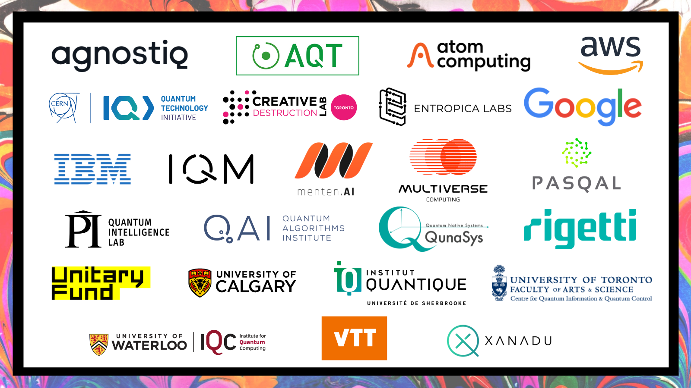

Welcome to [QHack](https://qhack.ai), the one-of-a-kind quantum computing hackathon! 

QHack has three main pillars:

- **[QHack Live Streams](https://twitch.tv/qhack)**: Streaming live at [twitch.tv/qhack](https://twitch.tv/qhack). Join us for exciting talks from our awesome lineup of top speakers. Tune in live to interact with the speakers and win raffle prizes. Runs Feb 14-18, 2022.

- **[QHack Coding Challenges](Coding_Challenges.md)**: Test out your quantum coding skills with 25 unique questions for all skill levels. Earn prizes and Power Ups by ranking on the leaderboard. Runs Feb 14-25, 2022.

- **[QHack Open Hackathon](Open_Hackathon.md)**: Showcase your creativity, problem-solving capabilities, and technical chops in this free-form hackathon. Share your own idea with the world, or start with one of project seeds. Multiple exclusive prizes are up for grabs. Runs Feb 21-25, 2022.

## What can I win?

This year there are more [prizes and power ups](https://qhack.ai/prizes) available than ever before, courtesy of our incredible sponsors. 

- **Internships**: This is your chance to work with some of the best quantum scientists and companies in the world, and get paid for it! 
- **On-site & Virtual Tours**: See where the magic happens with exclusive visits with your favourite quantum companies and researchers.
- **Hardware & Software Access**: Unlock exclusive quantum computing platforms from the top companies in the field.
- **Physical Prizes**: Prefer something you can get yor hands on? We've got you covered, with iPads, Oculus VR Headsets, Macbook Pros, signed textbooks, shirts, hats, and mugs.

There are also more ways you can win.

- **[Raffles](https://qhack.ai/events#raffles)**: Sign up for QHack, post on social media, join the live streams, or take part in the Coding Challenges and Open Hackathon. You've got a chance to win raffle prizes just by taking part!
- **[Design Competition](https://qhack.ai/events#design-competition)**: Who doesn't love clever quantum t-shirts? Submit your design for a chance to win awesome prizes, and have your shirt featured on the [Xanadu Shop](https://shop.xanadu.ai/).
- **[Meme Contest](https://qhack.ai/events#meme-contest)**: The OG quantum computing meme contest returns returns! Take home some sweet swag by creating the spiciest quantum memes.
- **[Open Hackathon Challenges](Open_Hackathon.md)**: Submit your team's Open Hackathon project to one (or more) of our sponsor's challenges. The best entries for each challenge win amazing and unique prizes.
- **[Coding Challenges](Coding_Challenges.md)**: Unlock power ups to put toward your Open Hackathon project (and beyond!) by placing high on the QHack Coding Challenges.

## Power Ups

**Free AWS Credits** 

Thanks to Amazon Braket you can power up your projects during the QHack Open Hackathon:
- **$400 in AWS Credits are available for up to 100 teams**: To unlock this Power Up, your team must place in the top 100 of the QHack Coding Challenges at 17h00 ET on Fri, Feb 18.
- **$2000 in AWS Credits are available for up to 15 teams**: To unlock this Power Up, your team must [submit a draft of your QHack Open Hackathon project](https://github.com/XanaduAI/QHack/issues/new?assignees=&labels=AWS+Power+Up&template=open-hackathon-aws-power-up-entry.md&title=%5BAWS+Power+Up%5D+Your+Project+Title) by 12h00 ET on Wed, Feb 23. Fifteen winners will be selected from the received submissions.

**Exclusive access to IBM Quantum machines**

 Thanks to IBM Quantum you can power up your projects during the QHack Open Hackathon:
 - **Access to 7-Qubit IBM Quantum machine**: To unlock this Power Up, your team must place in the top 70 of the QHack Coding Challenges at 17h00 ET on Fri, Feb 18.
 - **Access to 16-qubit IBM Quantum machine**: To unlock this Power Up, your team must [submit a draft of your QHack Open Hackathon project](https://github.com/XanaduAI/QHack/issues/new?assignees=&labels=IBM+Power+UP&template=open-hackathon-ibm-power-up-entry.md&title=%5BIBM+Power+Up%5D+Your+Project+Title) by 23h59 ET on Tues, Feb 22. Ten winners will be selected from the received submissions.
 
## Timeline

| Sun | Mon | Tue | Wed | Thu | Fri | Sat |
|---|---|---|---|---|---|---|
|   | **Feb 7**: [Coding Challenge Portal](https://challenge.qhack.ai) opens for team registration |  |  |  |  |  |
|   | **Feb 14**: <ul><li>Coding Challenge Questions available</li><li>QHack Livestream Day 1</li></ul> | **Feb 15**: QHack Livestream Day 2 | **Feb 16**: QHack Livestream Day 3 | **Feb 17**: QHack Livestream Day 4 | **Feb 18**:<ul><li>**AWS Power Up**: Win $400 USD in AWS credits (top 100 teams as of 17h00 ET)</li><li>**IBM Power Up**: Win access to IBM Quantum's 7-qubit machine (top 70 teams as of 17h00 ET)</li><li>QHack Livestream Day 5 (Spanish-language session)</li></ul> |  | 
|   | **Feb 21**: Open Hackathon begins | **Feb 22**: Submit draft Open Hackathon project if you want to be considered for access to IBM Quantum's 16-qubit machine (10 teams; must submit before 23h59 ET) | **Feb 23**: Submit draft Open Hackathon project if you want to be considered for $2000 USD in AWS credits (15 teams; must submit before 12h00 ET) |   | **Feb 25** (17h00 ET): <ul><li>Open Hackathon concludes</li><li>Coding Challenge portal closes</li></ul> |  |

## Sponsors

QHack is brought to you thanks to our amazing sponsors.

---

Please read our [terms and conditions](https://qhack.ai/terms-and-conditions/) for official eligibility and evaluation criteria. Entry void in Quebec.

Participants in the event agree to abide by the [QHack Code of Conduct](Code_of_Conduct.md).
